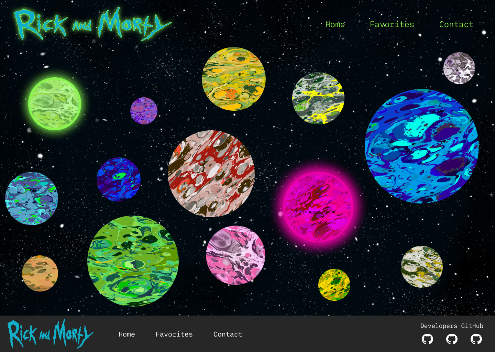

# Rick & Morty

Projeto Rick & Morty feito com base no protótipo no [**Figma**](https://www.figma.com/design/oOvVvexuXnwujisWAu8hWi/(Rick-%26-Morty-API)?node-id=87-3&t=m8YbG6ietLj7Mytf-0). Clicando no segundo planeta (abaixo do verde) você é direcionado para uma página contendo mais detalhes sobre ele. Clique [aqui](https://rick-morty-puce.vercel.app/) para acessar o projeto.

### Tecnologias utilizadas:

- SASS
- Mixins
- Vercel

---

Desenvolvido por [**Yasmin Gonçalves**](https://github.com/yasmingcv).